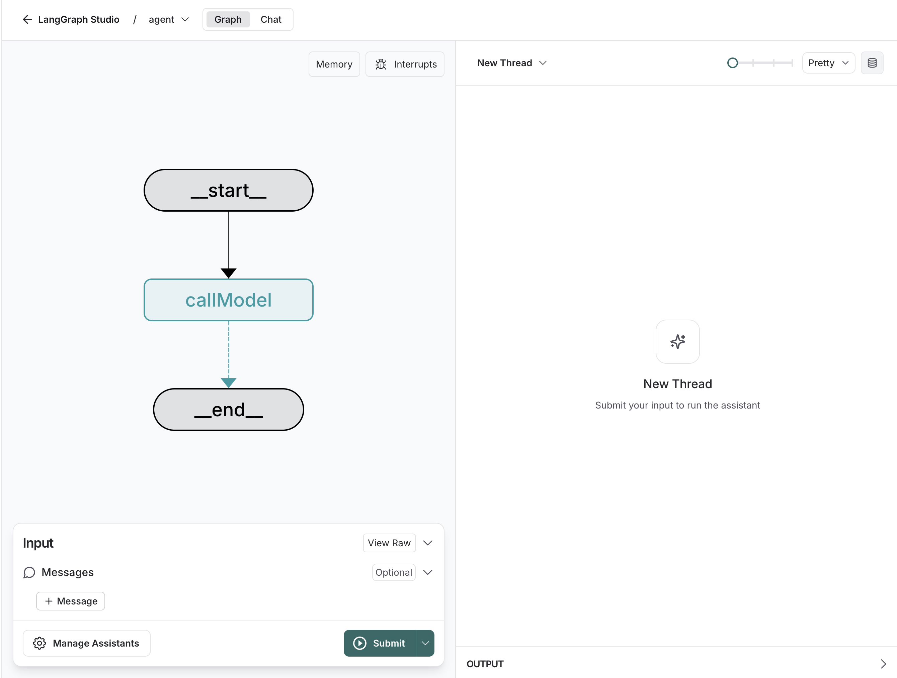

```mermaid
graph TD

    1808["User<br>External Actor"]
    1819["User<br>External Actor"]
    1822["User<br>External Actor"]
    subgraph 1797["External Systems"]
        1804["AI APIs<br>Google, Vertex AI, etc."]
        1805["Search APIs<br>Exa, Tavily, etc."]
        1806["Version Control APIs<br>GitHub, etc."]
        1807["Databases<br>MongoDB, etc."]
    end
    subgraph 1798["LangGraph Agent System<br>TypeScript / LangGraph"]
        1799["Library Entry Point<br>TypeScript"]
        1800["Agent Orchestration<br>LangGraph StateGraph"]
        1801["AI Model Providers<br>TypeScript"]
        1802["Agent Tools<br>TypeScript"]
        1803["State &amp; Memory Persistence<br>TypeScript / MongoDB"]
        %% Edges at this level (grouped by source)
        1799["Library Entry Point<br>TypeScript"] -->|Starts| 1800["Agent Orchestration<br>LangGraph StateGraph"]
        1800["Agent Orchestration<br>LangGraph StateGraph"] -->|Invokes| 1801["AI Model Providers<br>TypeScript"]
        1800["Agent Orchestration<br>LangGraph StateGraph"] -->|Delegates to| 1802["Agent Tools<br>TypeScript"]
        1800["Agent Orchestration<br>LangGraph StateGraph"] -->|Reads/writes state to| 1803["State &amp; Memory Persistence<br>TypeScript / MongoDB"]
    end
    subgraph 1809["External Systems"]
        1816["AI APIs<br>Google AI, Vertex AI, etc."]
        1817["Third-Party Tools<br>GitHub, Tavily, Exa, etc."]
        1818["Databases<br>MongoDB, etc."]
    end
    subgraph 1810["LangGraph Agent Framework<br>TypeScript"]
        1811["Core Agent Graph<br>TypeScript"]
        1812["Agent Implementations<br>TypeScript"]
        1813["Tool Integrations<br>TypeScript"]
        1814["State &amp; Memory Management<br>TypeScript"]
        1815["Configuration &amp; Providers<br>TypeScript"]
        %% Edges at this level (grouped by source)
        1811["Core Agent Graph<br>TypeScript"] -->|Delegates to| 1812["Agent Implementations<br>TypeScript"]
        1811["Core Agent Graph<br>TypeScript"] -->|Persists state to| 1814["State &amp; Memory Management<br>TypeScript"]
        1811["Core Agent Graph<br>TypeScript"] -->|Uses| 1815["Configuration &amp; Providers<br>TypeScript"]
        1812["Agent Implementations<br>TypeScript"] -->|Uses| 1813["Tool Integrations<br>TypeScript"]
    end
    subgraph 1820["External Systems"]
        1828["AI APIs<br>Google, Vertex AI, etc."]
        1829["Search &amp; Data APIs<br>Tavily, Exa, etc."]
        1830["Code Hosting APIs<br>GitHub, etc."]
        1831["Databases<br>MongoDB, etc."]
    end
    subgraph 1821["LangGraph Agent Framework<br>TypeScript / Node.js"]
        1823["Graph Orchestrator<br>LangGraph"]
        1824["Agent Implementations<br>Code Directory"]
        1825["External Tools<br>Code Directory"]
        1826["State &amp; Persistence<br>Code Directory"]
        1827["Configuration &amp; Providers<br>Code Directory"]
        %% Edges at this level (grouped by source)
        1823["Graph Orchestrator<br>LangGraph"] -->|orchestrates| 1824["Agent Implementations<br>Code Directory"]
        1823["Graph Orchestrator<br>LangGraph"] -->|uses| 1826["State &amp; Persistence<br>Code Directory"]
        1824["Agent Implementations<br>Code Directory"] -->|executes tasks with| 1825["External Tools<br>Code Directory"]
        1824["Agent Implementations<br>Code Directory"] -->|updates| 1826["State &amp; Persistence<br>Code Directory"]
        1824["Agent Implementations<br>Code Directory"] -->|retrieves models from| 1827["Configuration &amp; Providers<br>Code Directory"]
    end
    %% Edges at this level (grouped by source)
    1808["User<br>External Actor"] -->|Initiates Agent Workflow| 1799["Library Entry Point<br>TypeScript"]
    1801["AI Model Providers<br>TypeScript"] -->|Calls| 1804["AI APIs<br>Google, Vertex AI, etc."]
    1802["Agent Tools<br>TypeScript"] -->|Queries| 1805["Search APIs<br>Exa, Tavily, etc."]
    1802["Agent Tools<br>TypeScript"] -->|Interacts with| 1806["Version Control APIs<br>GitHub, etc."]
    1803["State &amp; Memory Persistence<br>TypeScript / MongoDB"] -->|Stores/retrieves from| 1807["Databases<br>MongoDB, etc."]
    1819["User<br>External Actor"] -->|Initiates workflow| 1811["Core Agent Graph<br>TypeScript"]
    1815["Configuration &amp; Providers<br>TypeScript"] -->|Calls| 1816["AI APIs<br>Google AI, Vertex AI, etc."]
    1813["Tool Integrations<br>TypeScript"] -->|Calls| 1817["Third-Party Tools<br>GitHub, Tavily, Exa, etc."]
    1814["State &amp; Memory Management<br>TypeScript"] -->|Reads/writes| 1818["Databases<br>MongoDB, etc."]
    1822["User<br>External Actor"] -->|initiates workflow| 1823["Graph Orchestrator<br>LangGraph"]
    1827["Configuration &amp; Providers<br>Code Directory"] -->|calls| 1828["AI APIs<br>Google, Vertex AI, etc."]
    1825["External Tools<br>Code Directory"] -->|calls| 1829["Search &amp; Data APIs<br>Tavily, Exa, etc."]
    1825["External Tools<br>Code Directory"] -->|calls| 1830["Code Hosting APIs<br>GitHub, etc."]
    1826["State &amp; Persistence<br>Code Directory"] -->|persists to| 1831["Databases<br>MongoDB, etc."]
```

# LangGraph.js Project

[](https://github.com/langchain-ai/new-langgraphjs-project/actions/workflows/unit-tests.yml)
[](https://github.com/langchain-ai/new-langgraphjs-project/actions/workflows/integration-tests.yml)

This template demonstrates a simple chatbot implemented using [LangGraph.js](https://github.com/langchain-ai/langgraphjs), showing how to get started with [LangGraph Server](https://langchain-ai.github.io/langgraph/concepts/langgraph_server/#langgraph-server) and using [LangGraph Studio](https://langchain-ai.github.io/langgraph/concepts/langgraph_studio/), a visual debugging IDE.

<p align="center">
  
</p>

The core logic, defined in `src/agent/graph.ts`, showcases a straightforward chatbot that responds to user queries while maintaining context from previous messages.

## Concept Overview

This project provides a foundation that can be easily customized and extended to create more complex conversational agents.
It has been expanded to include:

- **React Agent**: A specialized agent that can handle user requests requiring dynamic interaction, such as providing real-time updates or executing tasks based on user input.
- **Research Agent**: A specialized agent that can perform research tasks, such as collecting information from external sources, summarizing findings, and generating reports based on user queries.
- **Chat Node**: The main conversation node that handles general user interactions and maintains context.
- **Supervisor Node**: A decision-making node that routes user requests to the appropriate agent based on the type of request (e.g., general chat, research, or dynamic interaction).
- **State Management**: The chatbot maintains context and state across interactions, allowing for more coherent conversations.
- **Error Handling**: Basic error handling is included to manage issues during LLM calls or tool invocations.
- **Integration with LangSmith**: The project includes optional integration with [LangSmith](https://smith.langchain.com/) for tracing and monitoring the chatbot's performance.
- **Hot Reloading**: Changes to the graph or code can be applied in real-time during development, allowing for rapid iteration and testing.
- **CLI Interaction**: The project supports interaction via the LangGraph CLI, allowing for testing and debugging without needing a full UI.
- **Visual Debugging**: LangGraph Studio provides a visual interface to edit and debug the graph, making it easier to understand the flow of the chatbot and make adjustments as needed.
- **Node.js Environment**: The chatbot runs in a Node.js environment, making it easy to deploy and integrate with other systems.
- **Modular Design**: The project is designed to be modular, allowing for easy addition of new agents, tools, or workflows as needed.
- **Tool Library**: The project includes a basic tool library that can be extended with custom tools for specific tasks.

## Getting Started

### 1. Install the [LangGraph CLI](https://langchain-ai.github.io/langgraph/concepts/langgraph_cli/)

```bash
npx @langchain/langgraph-cli
```

### 2. Create a `.env` file. While this starter app does not require any secrets, if you later decide to connect to LLM providers and other integrations, you will likely need to provide API keys

```bash
cp .env.example .env
```

### 3. If desired, add your LangSmith API key in your `.env` file

```bash
# Example .env file content
LANGSMITH_API_KEY=lsv2...
```

<!--
Setup instruction auto-generated by `langgraph template lock`. DO NOT EDIT MANUALLY.
-->

<!--
End setup instructions
-->

### 4. Install dependencies

```bash
# If you are using npm
npm install
```

### 5. Customize the code as needed

- Modify the system prompt in `src/agent/graph.ts` to give your chatbot a unique personality.
- Add new nodes to the graph for more complex conversation flows.
- Implement conditional logic to handle different types of user inputs.

### 6. Start the LangGraph Server.

- This will run the server locally and open LangGraph Studio in your browser.
- You can edit the graph and see changes in real-time.
- You can also use the CLI to interact with the server.

```bash
npx @langchain/langgraph-cli dev
```

For more information on getting started with LangGraph Server, [see here](https://langchain-ai.github.io/langgraph/tutorials/langgraph-platform/local-server/).

## How to customize

1. **Add an LLM call**: You can select and install a chat model wrapper from [the LangChain.js ecosystem](https://js.langchain.com/docs/integrations/chat/), or use LangGraph.js without LangChain.js.
2. **Extend the graph**: The core logic of the chatbot is defined in [graph.ts](./src/agent/graph.ts). You can modify this file to add new nodes, edges, or change the flow of the conversation.

You can also extend this template by:

- Adding [custom tools or functions](https://js.langchain.com/docs/how_to/tool_calling) to enhance the chatbot's capabilities.
- Implementing additional logic for handling specific types of user queries or tasks.
- Add retrieval-augmented generation (RAG) capabilities by integrating [external APIs or databases](https://langchain-ai.github.io/langgraphjs/tutorials/rag/langgraph_agentic_rag/) to provide more customized responses.

## Development

While iterating on your graph, you can edit past state and rerun your app from previous states to debug specific nodes. Local changes will be automatically applied via hot reload. Try experimenting with:

- Modifying the system prompt to give your chatbot a unique personality.
- Adding new nodes to the graph for more complex conversation flows.
- Implementing conditional logic to handle different types of user inputs.

Follow-up requests will be appended to the same thread. You can create an entirely new thread, clearing previous history, using the `+` button in the top right.

For more advanced features and examples, refer to the [LangGraph.js documentation](https://langchain-ai.github.io/langgraphjs/). These resources can help you adapt this template for your specific use case and build more sophisticated conversational agents.

LangGraph Studio also integrates with [LangSmith](https://smith.langchain.com/) for more in-depth tracing and collaboration with teammates, allowing you to analyze and optimize your chatbot's performance.

<!--
Configuration auto-generated by `langgraph template lock`. DO NOT EDIT MANUALLY.
{
  "config_schemas": {
    "agent": {
      "type": "object",
      "properties": {}
    }
  }
}
-->


